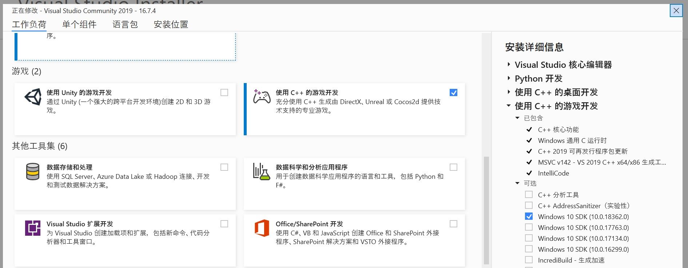
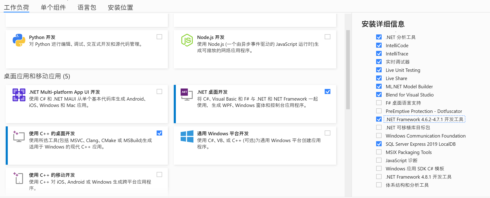
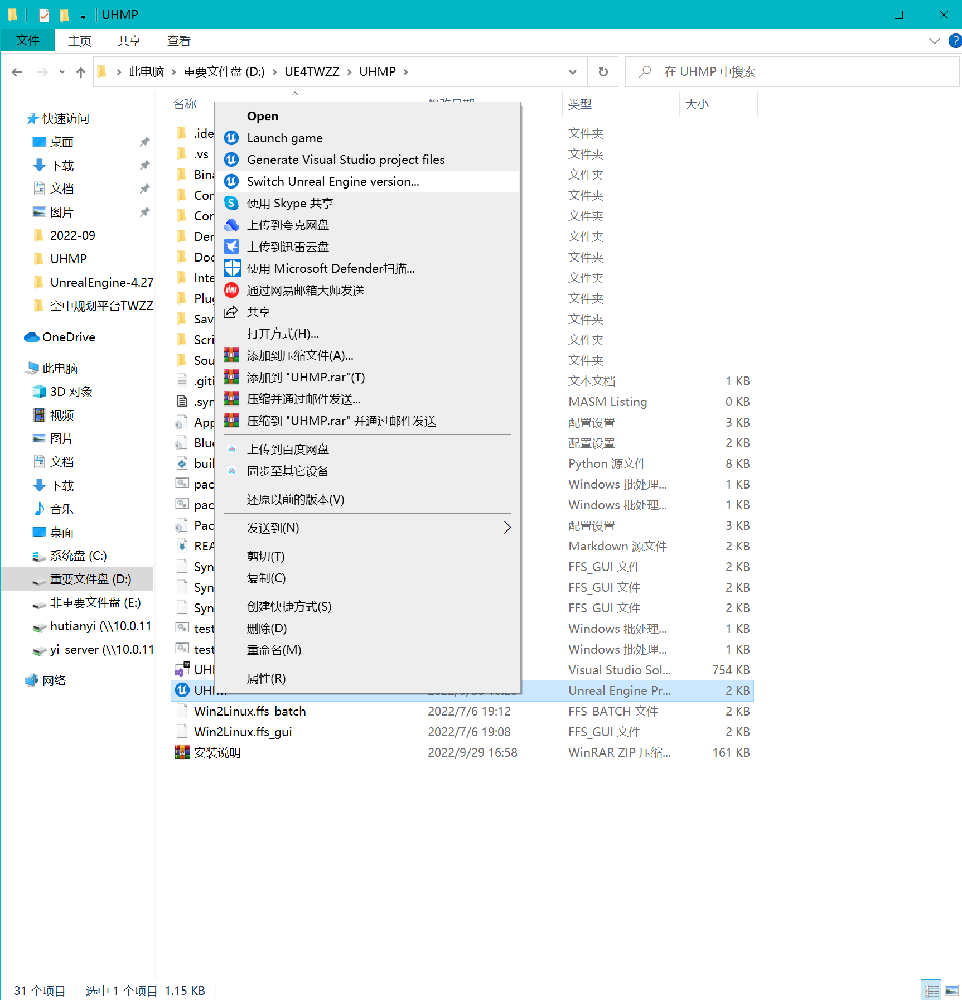
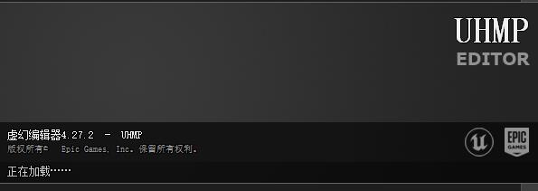

# UHMAP

Developed with Unreal Engine 4

# How to install | 如何安装自定义版本的虚幻引擎
另见视频：
https://ageasga-my.sharepoint.com/:v:/g/personal/fuqingxu_yiteam_tech/EawfqsV2jF5Nsv3KF7X1-woBH-VTvELL6FSRX4cIgUboLg?e=Vmp67E

## 1. 下载 Visual Studio Community

https://visualstudio.microsoft.com/zh-hans/

## 2. 安装 Visual Studio Community

需要至少安装C++的桌面开发和C++的游戏开发两部分，安装版本见截图；另需安装.NET框架，版本为4.6.2

## 3. 下载虚幻引擎源代码 (非官方，修改过源码)

https://ageasga-my.sharepoint.com/:u:/g/personal/fuqingxu_yiteam_tech/Ee3lQrUjKNFMjPITm5G-hEgBbeEN6dMOPtKP9ssgONKJcA?e=BavOoJ

## 4. 编译虚幻引擎
1. 解压源代码（到至少150GB空间的磁盘）

1. Open your source folder in Explorer and run **Setup.bat**. 
   This will download binary content for the engine, as well as installing prerequisites and setting up Unreal file associations. 
   On Windows 8, a warning from SmartScreen may appear.  Click "More info", then "Run anyway" to continue. 运行**Setup.bat**
   
   A clean download of the engine binaries is currently 3-4gb, which may take some time to complete.
   Subsequent checkouts only require incremental downloads and will be much quicker. 需要一段时间
 
1. Run **GenerateProjectFiles.bat** to create project files for the engine. It should take less than a minute to complete.  运行 **GenerateProjectFiles.bat**

1. Load the project into Visual Studio by double-clicking on the **UE4.sln** file. Set your solution configuration to **Development Editor** and your solution
   platform to **Win64**, then right click on the **UE4** target and select **Build**. It may take anywhere between 10 and 40 minutes to finish compiling, depending on your system specs. 打开**UE4.sln**，界面顶部的项目配置为**Development Editor** 和 **Win64**， 右击界面右侧菜单的**UE4**，点击**Build**，需要20分钟~1小时时间编译(配置好后，点选界面上面栏目中的生成Build，点击生成UE4)

1. 右键点击项目工程文件夹中的UHMP.uproject，按照图示选择虚幻引擎版本为4.27.2-release，进行初步生成项目的操作；之后打开UHMP.sln，将界面顶部的项目配置为**Development Editor** 和 **Win64**，点选右侧资源管理器中的UHMP，再点击界面顶部的生成-->生成UHMP；完成后双击UHMP.uproject打开工程项目

6. 成功打开的虚幻编辑器加载界面应当如下图所示

