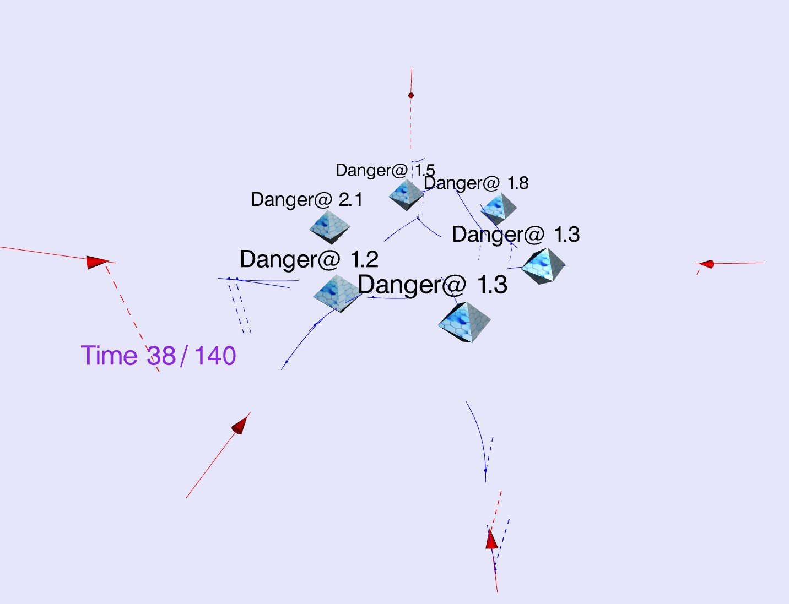
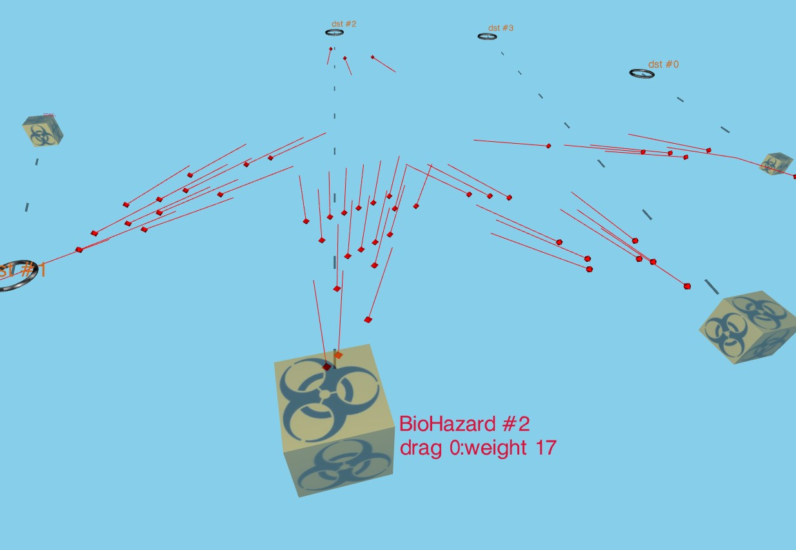
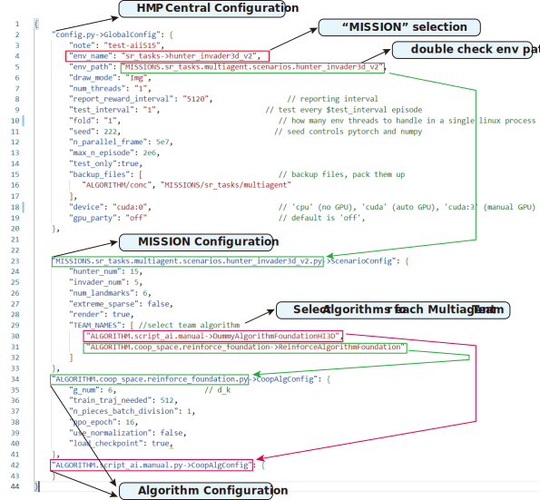
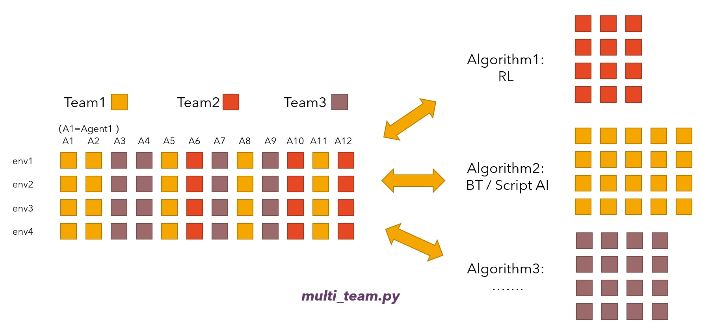
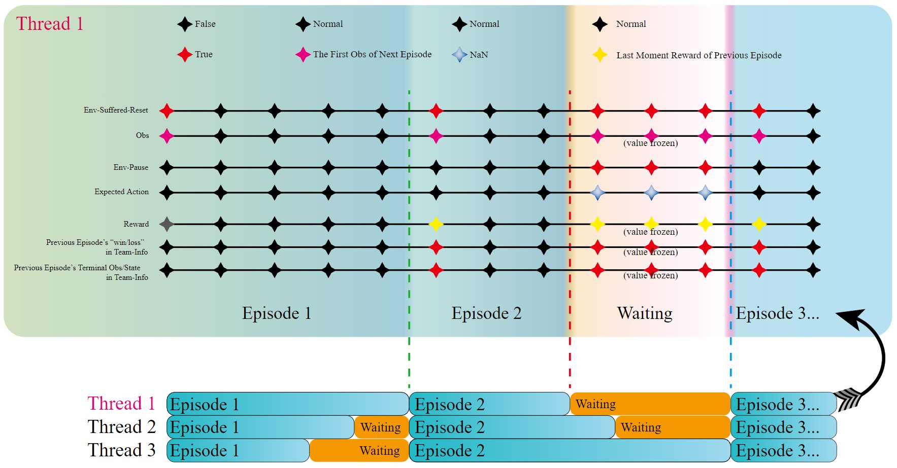

Author: Fu Qingxu, CASIA

# Introduction
The Hybrid Multi-agent Playground (HMP) is an experimental framework designed for Reinforcement Learning (RL) researchers.
Unlike any other framework which only isolates the TASKs from the framework, 
HMP also separates the ALGORITHMs from the framework to achieve excellent compatibility.

Any algorithm, from the most straightforward script-AI to sophisticated RL learner,
is abstracted into a module inside ./ALGORITHM/*.

We also put effect to interface all kinds of multi-agent environments,
including gym, SMAC, air combat, et.al.
Other frameworks, such as pymarl2, can interface with HMP as well.
The entire HMP can disguise as an RL environment in pymarl2.
We make it happen by building a particular ALGORITHM module, which
runs pymarl2 in a subprocess. This work is ongoing. Currently, HMP can link to a modified version of pymarl2.

**Please ```star``` the root Github project. Your encouragement is extremely important to us as researchers: ```https://github.com/binary-husky/hmp2g```**

Archived code used in our AAAI papers: ```https://github.com/binary-husky/hmp2g/tree/aaai-conc```.

# Demo
## Unreal-Engine-Based Simulation
<div align="center">

</div>
Note: render client is not included in the docker image. For visualization,
refer to https://github.com/binary-husky/uhmap-visual-tool git resp.

``` sh
git pull && python main.py -c ZHECKPOINT/uhmap_hete10vs10/render_result.jsonc
```

## Web Demo of DCA (AAAI Paper Version)

```
http://cloud.fuqingxu.top:11601/
```
<div align="center">

</div>

## Decentralized Collective Assult (Improved Version, more Difficult Than AAAI Paper Version)

```
git pull && python main.py -c ZHECKPOINT/50RL-55opp/test-50RL-55opp.jsonc
(Also see https://www.bilibili.com/video/BV1vF411M7N9/)
```

## Anti-Invasion Interception
<div align="center">

</div>

```
git pull && python main.py -c ZHECKPOINT/test-aii515/test-aii515.jsonc --skip 
```

## Hazardous Cargo Transport
<div align="center">

</div>

```
git pull && python main.py -c ZHECKPOINT/test-cargo50/test-cargo50.jsonc --skip
```

## Decentralized Collective Assult (AAAI Paper Version)
```
git pull && python main.py -c ZHECKPOINT/test-50+50/test-50+50.jsonc --skip
git pull && python main.py -c ZHECKPOINT/test-100+100/test-100+100.jsonc --skip
```

# Dependency
We use docker to solve dependency: [SetupDocker](./ZDOCS/setup_docker.md).

Please do not run on WindowsOS (low efficiency), 
but if you have to, 
also refer to the last part of [setup_docker](./ZDOCS/setup_docker.md) for pip requirements list. 


# Introducing the Structure of HMP
## HMP's General Framework Structure

## HMP's Config System (How to experiment)
HMP aims to optimize the parameter control experience as a framework for researchers. 
One configuration file is all that is needed for the config insertion.

<div align="center">

</div>

### <1> How to Config:
We discard the command line method to control parameters; instead, the commented-JSON (JSONC) is used for experiment configuration. To run an experiment, just type:
```
python main.py --cfg Json_Experiment_Config_File.jsonc
```
### <2> How to Add and Override A Parameter:
Parameters assigned and overridden in the JSON file are NOT passed via init functions layer by layer as other frameworks usually do; instead, at the start of the ```main.py```, a special program defined in ```UTIL/config_args.py``` will directly INJECT the overridden parameters to the desired location.

We give an example to demonstrate how simple it is to add new parameters. 
Suppose we want to introduce HP into DCA, then an initial HP, let say ```HP_MAX``` need to be defined as a parameter.
Then:
- Open ```MISSION/collective_assult/collective_assult_parallel_run.py```. (You can create new file if you wish so.)
- (Step1, Define It !) In ```ScenarioConfig``` class add a new line writing ```HP_MAX=100```. (You can create another class if you wish so.)
- (Step2, Use It !) Anywhere you want to use the ```HP_MAX```, first ```from xxx.collective_assult_parallel_run import ScenarioConfig```,
then use the parameter by ```init_hp_of_some_agent = ScenarioConfig.HP_MAX```.
- (Step3, Change It !) To override the default value ```HP_MAX=100``` in JSON (e.g., in ```./example_dca.jsonc```), 
you just need to add a line in the field ```"MISSION.collective_assult_debug.collective_assult_parallel_run.py->ScenarioConfig"```,
for example:
```Jsonc
{
    ...... (other field)
    "MISSION.collective_assult_debug.collective_assult_parallel_run.py->ScenarioConfig": {
        "HP_MAX": 222,  # <------ add this!
        "random_jam_prob": 0.05,    # (other config override in ScenarioConfig)
        ......
    },
    ...... (other field)
}
```
- You need not to worry about the format. You can write ```{"HP_MAX": 222}``` or  ```{"HP_MAX": "222"}```. If the value is a bool, you can write ```{"Key1":true,"Key2":false}``` or ```{"Key1":"True", "Key2":"False"}```. **Both are OK**.
- Be aware, in Step2, ```HP_MAX=100``` defines ```HP_MAX``` as Int. If you want a float, please write ```HP_MAX=100.0```. Overriding an Int with float will trigger an assert error.
- All Done! Say bye-bye to annoying args passing and kwargs passing!

### <3> How to Deal with Parameter Dependency:
Our framework can fully support complicated parameter dependency. 
Some parameters are sometimes just Chained together. 
Changing one of them can lead to the change of another. 
E.g., Let the number of parallel envs (```num_threads```) be 32, 
and we test the performance of every ```test_interval``` episode. We wish to have relate them with ```test_interval``` = 8*```num_threads```, 
meaning that a test run is shot every 8 rounds of parallel env executions.
This function can be satisfied by defining a Chained var structure:
``` python
num_threads = 32  # run N parallel envs,
# define test interval
test_interval = 8*num_threads
# define the Chains of test interval
test_interval_cv = ChainVar(lambda num_threads:8*num_threads, chained_with=['num_threads'])
# all done! You need to do nothing else!
```
After this, you can expect the following override (JSON config override) behaviors:
- Changing Neither in JSON, then both parameters use the default (```num_threads``` = 32, ```test_interval``` = 8*32)
- Changing only ```num_threads``` in JSON, then ```test_interval``` is also forced to change according to ```test_interval=8*num_threads```.
- Changing only ```test_interval``` in JSON, the Chain will not work, obey JSON override, nothing has higher priority than an explicit JSON override.
- Changing both JSON, the Chain will not work, both obey JSON override, and nothing has higher priority than an explicit JSON override.

For details, please refer to ```config.py``` and ```UTIL/config_args.py```, 
it is straightforward to understand once you read an example of this.

### <4> How to Recover Configuration's Auto Backup:
When the experiment starts, the Json config override will be stored in ```ZHECKPOINT/the-experiment-note-you-defined/experiment.json```.
If the experiment later produces surprising results,
you can consistently reproduce it again using this config backup.


## Task Runner
Task Runner (```task_runner.py```) only has three lines of important code:
``` python
# line 1
actions_list, self.info_runner = self.platform_controller.act(self.info_runner)
# line 2: 
obs, reward, done, info = self.envs.step(actions_list)
# line 3: 
self.info_runner = self.update_runner(done, obs, reward, info)
```

- ```self.platform_controller.act```: Get action, block information access between teams (LINK to ```ARGORITHM```), handle algorithm internal state loopback.


- ```self.envs.step```: Multi-thread environment step (LINK to ```MISSION```).
- ```self.update_runner```: Prepare obs (for decision making) and reward (for driving RL algorithms) for the next step.


## The Time Sequence of HMP
In general, the HMP task runner can operate two ways:
- (Deprecated due) self.align_episode = False: threads immediately restart at terminal state, threads do not wait for each other
- self.align_episode = True: threads pause at terminal state, waiting until all threads terminate, then reset. Please refer to [Hmp Time Sequence](./VISUALIZE/md_imgs/hmp2g_timeline.svg). 
<div align="center">

</div>


## MISSION
Please refer to [MISSION README](./MISSION/readme.md).

## Execution Pool
We designed a parallel execution pool based on shared memory,
the most efficient inter-process communication method possible.
This parallel pool is only functional on Linux, 
therefore, 
when running on Windows,
we will automatically switch to a backup pool using the pipe.

- The efficient execution pool is defined in ```UTIL/shm_pool.pyx```
- The windows-compatible execution pool is defined in ```UTIL/win_pool.py```

Both of them is initialized in ```main.py```, and they share the same APIs:
```
smart_pool = SmartPool(...)
```

Furthermore, the pickle and the reverse-pickle process is slow for large NumPy arrays,
we solve this problem by copying raw NumPy memory directly to the shared memory area without pickle 
and significantly improve the data transfer efficiency.

When dealing with a large number of parallel environments (100+),
the process coordination of OS can slow down even shared-memory communication.

As a compromise,
we design a ```folding``` mechanism to allow a single process to run ```N=fold``` parallel environments to relieve the burden of OS.
When folding is disabled (default disabled), ```fold=1```.

However, note that setting ```fold>1``` will not accelerate the parallel FPS (and usually decrease the FPS) for a single experiment,
but it allows you to run more experiments simultaneously on the server.


## VHMAP, Visualization of HMP
VHMAP is a visualization component of HMP. [VHMAP](./VISUALIZE/README.md)

It is unfortunate that 
all existing RL environments fail to provide a visual
interface satisfying the following useful features:

- Allowing visualizing while training without slowing down the training server. 
- Using as few resources as possible.
- Friendly to SSH users, faster than RDP and X server, which is notoriously slow.
- No dependency, even an Android with a browser can access it.
- Smooth, using the client's CPU and GPU to render instead of the server's.
- Simple. No verbose lines about lights, buffering, refresh, and bla.bla.bla about which we researchers never care.

VHMAP is just the answer, Features:
- Python interface simplified to the max
- Rendering on the client side, automatic frame insertion, and silky smooth frame rates
- Few server-side dependencies
- Very low server-side resource consumption
- Based on ThreeJs, drag and drop support, mobile touch screen support
- Support switching between perspective and projection views
- Playback support
- Use zlib to compress data streams, low network bandwidth requirement

<div align="center">

</div>

Interface functions, operation introduction.
- Right mouse button to pan, left mouse button to rotate, scroll wheel to zoom
- Support touch screen. If your laptop or phone has a touch screen
- Rendering refresh rate is displayed in the upper left corner
- play fps: how many keyframes per second (less than the rendering refresh rate, then insert frames; greater than the rendering refresh rate, then the excess is invalid)
- pause: pause
- next frame: pause and switch the next frame
- previous frame: pause and switch the previous frame
- loop to start: play all data, go back to the first frame
- ppt step: play a frame at a very slow speed. Easy to record the screen, will be stuck for a few seconds after pressing
- use orthcam: switch the perspective view (object near large and far small)/projection view (similar to what you would use in engineering drawing)
- P.S. The first time you switch to the projection view, you need to use the mouse wheel to enlarge the screen


# Quick Start

## Dependency
We use docker to solve dependency: 
[setup_docker](./ZDOCS/setup_docker.md). 
This project uses techniques such as shared memory for extreme training efficiency, 
as a cost, 
WindowsOS+GPU training is not well supported (using pipe IO for Windows compat).

For Windows (Not recommended, please do NOT run under Windows if possible), 
also refer to the last part of [setup_docker](./ZDOCS/setup_docker.md) for pip requirements list. 

Please read [setup_docker.md](./ZDOCS/setup_docker.md) first, and then set up the container using:
```bash
$ docker run -itd   --name  hmp-$USER \
--net host \
--gpus all \
--shm-size=16G \
fuqingxu/hmp:latest

# Now inside the HMP container
$ su hmp # (switch the account Inside the HMP container, password: hmp)
$ cd ~   # (go to home directory)
```


## AAAI 2022
### 1. All Default: Testing
```
git pull && python main.py -c ZHECKPOINT/test-50+50/test-50+50.jsonc --skip
git pull && python main.py -c ZHECKPOINT/test-100+100/test-100+100.jsonc --skip
```
When the testing starts, open the revealed URL for monitoring. The front end is done by JavaScript and ThreeJS.
```
--------------------------------
JS visualizer online: http://172.18.116.150:aRandomPort
JS visualizer online (localhost): http://localhost:aRandomPort
--------------------------------
```
### 2. All Default: Training

```
git pull && python main.py -c ZDOCS/examples/dca/example_dca.jsonc
git pull && python main.py -c ZDOCS/examples/dca/train_old_dca.jsonc
```


### 3. Change Settings

Launch with: 
```
python main.py --cfg xx.json
```

## IJCNN 2022
### 
```
git pull && python main.py -c ZHECKPOINT/test-aii515/test-aii515.jsonc --skip 
git pull && python main.py -c ZHECKPOINT/test-cargo50/test-cargo50.jsonc --skip
```

## Others

```
git pull && python main.py --cfg ZHECKPOINT/adca-demo/test.json
git pull && python main.py --cfg ZHECKPOINT/basic-ma-40-demo/test.json
```


# Project Roadmap
If you are interested in something, you may continue to read:
```
    Handling parallel environment             -->   task_runner.py & shm_env.py

    The link between teams and diverse algorithms -->   multi_team.py

    Adding new env                            -->   MISSION.env_router.py

    Adding algorithm                          -->   ALGORITHM.example_foundation.py

    Configuring by writing py files           -->   config.py

    Configuring by JSONC                       -->   xx.jsonc

    colorful printing                         -->   colorful.py

    auto pip deployer                         -->   pip_find_missing.py

    efficient parallel execting               -->   shm_pool.pyx

    auto GPU selection                        -->   auto_gpu.py

    logging/plotting bridge            -->   mcom.py & mcom_rec.py

    experiment batch executor                 -->   mprofile.py
```

# How to Add a New Environment (MISSION) in HMP
Please refer to [MISSION README](./MISSION/readme.md) for more details.


- Make a new jsonc config file, using 'example.jsonc' as a template
- mkdir in MISSION, e.g. ./MISSION/bvr_sim, copy src code of the environment inside it.
- Open ```MISSION/env_router.py```, add the path of environment's init function in ```env_init_function_ref```, e.g.:
``` python
env_init_function_ref = {
    "bvr": ("MISSION.bvr_sim.init_env", "make_bvr_env"),
}   
# bvr is the final name that HMP recognizes, 
# MISSION.bvr_sim.init_env is a py file, 
# ScenarioConfig is a class
```
- Open ```MISSION/env_router.py```, add the path of environment's configuration in ```import_path_ref```
``` python
import_path_ref = {
    "bvr": ("MISSION.bvr_sim.init_env", 'ScenarioConfig'),
}   
# bvr will be the final name that HMP recognizes, 
# MISSION.bvr_sim.init_env is a py file, 
# make_bvr_env is a function
```
- Write your own ScenarioConfig. (refer to ```MISSION.bvr_sim.init_env.ScenarioConfig```, as a template).
- Write your own env init function. (refer to ```MISSION.bvr_sim.init_env.make_bvr_env```, as a template).


# Papers Supported by HMP

```
@article{fu2022concentration,
    title        = {Concentration Network for Reinforcement Learning of Large-Scale Multi-Agent Systems},
    author       = {Fu, Qingxu and Qiu, Tenghai and Yi, Jianqiang and Pu, Zhiqiang and Wu, Shiguang},
    year         = 2022,
    month        = {Jun.},
    journal      = {Proceedings of the AAAI Conference on Artificial Intelligence},
    volume       = 36,
    number       = 9,
    pages        = {9341--9349},
    doi          = {10.1609/aaai.v36i9.21165},
    url          = {https://ojs.aaai.org/index.php/AAAI/article/view/21165}
}


@inproceedings{fu2022cooperation,
    title        = {A Cooperation Graph Approach for Multiagent Sparse Reward Reinforcement Learning},
    author       = {Fu, Qingxu and Qiu, Tenghai and Pu, Zhiqiang and Yi, Jianqiang and Yuan, Wanmai},
    year         = 2022,
    booktitle    = {2022 International Joint Conference on Neural Networks (IJCNN)},
    pages        = {1--8},
    doi          = {10.1109/IJCNN55064.2022.9891991}
}

@article{fu2022solving,
    title        = {Solving the Diffusion of Responsibility Problem in Multiagent Reinforcement Learning with a Policy Resonance Approach},
    author       = {Fu, Qingxu and Qiu, Tenghai and Yi, Jianqiang and Pu, Zhiqiang and Ai, Xiaolin and Yuan, Wanmai},
    year         = 2022,
    journal      = {arXiv preprint arXiv:2208.07753}
}


```


