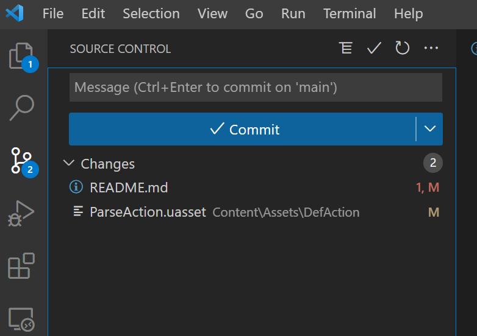
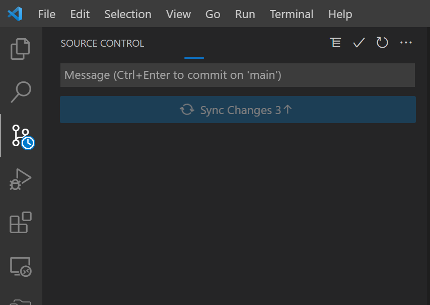
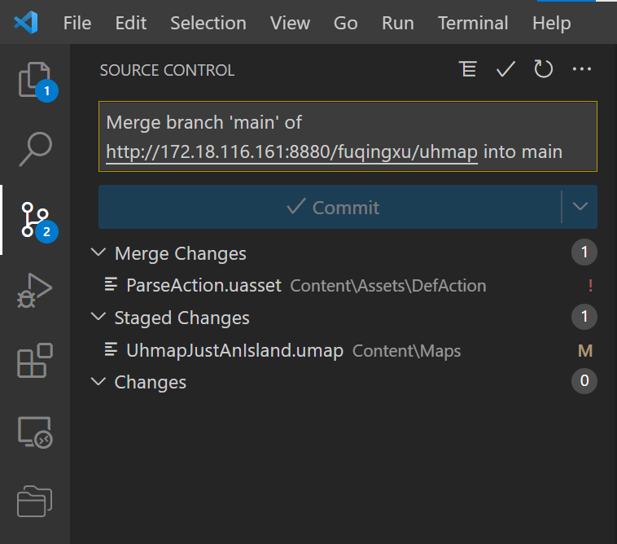

# UHMAP

Developed with Unreal Engine 4

# How to install | 如何安装
见 “虚幻引擎安装方法 / README.md” 文件

# 如何将修改同步到远程
### 0. 首先关闭虚幻引擎！

### 1. 打开vscode，切换到git页面
<div align="center">

</div>

### 2. 填写message，然后点击commit
### 3. 再点击sync changes，然后出现下面界面（也有可能直接顺利完成，忽略以下步骤即可）
<div align="center">

</div>
<div align="center">

</div>

### 4. 如果没有“Merge Changes”，再次点击提交即可，但一般都会有若干项“Merge Changes”，即和其他人发生冲突的文件，需要进行处理

### 5. 如有“Merge Changes”，打开终端

#### 5-1 （确实对该文件做出过有意义的修改）如果想保存本地，无视远程文件，强行把本地文件汇入远程：
终端命令：
```
   git checkout --ours /path/to/file
   git add /path/to/file
```
在此例子中，
```
   git checkout --ours Content\Assets\DefAction\ParseAction.uasset
   git add Content\Assets\DefAction\ParseAction.uasset
```
#### 5-2 （无意修改此文件，或该文件属于其他人的管辖范围）如果想覆盖本地文件，采纳远程文件：
终端命令：
```
   git checkout --theirs /path/to/file
   git add /path/to/file
```
在此例子中，
```
   git checkout --theirs Content\Assets\DefAction\ParseAction.uasset
   git add Content\Assets\DefAction\ParseAction.uasset
```


### 6. 再次点击Commit，完成流程
