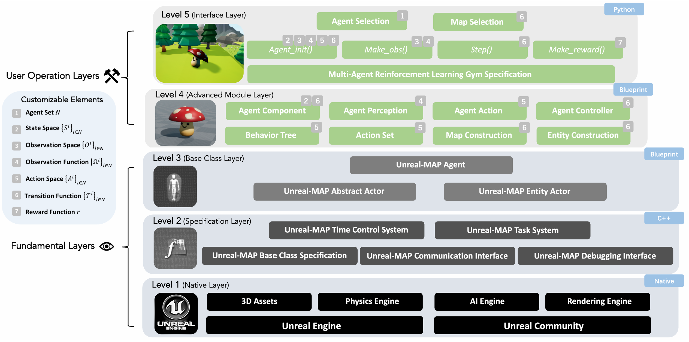

# Unreal-MAP 

[English](README.md) | [中文](README_CN.md)

[](https://github.com/binary-husky/unreal-map)
[](LICENSE)
[](https://www.python.org/)
[](https://www.unrealengine.com/)
[](https://github.com/binary-husky/unreal-map)
[](README.md)


This is **Unreal Multi-Agent Playground** (Unreal-Map), an multi-agent general platform based on [Unreal Engine](https://www.unrealengine.com/).
Here you can use all the capabilities of Unreal Engine (Blueprints, Behavior tree, Physics engine, AI navigation, 3D models/animations and Plugin resources, etc) to build elegant (but also computational efficient) and magnificent (but also experimentally reproducible) multi-agent environments.

Unreal-MAP can not only be used to develop conventional multi-agent simulation environments, but has also been specifically optimized for Multi-Agent Reinforcement Learning (MARL) simulation. You can use it to develop various realistic and complex MARL scenarios. You can also use Unreal-MAP together with our developed [HMAP](https://github.com/binary-husky/hmp2g) (a powerful MARL-specific experimental framework) to easily develop MARL scenarios and quickly deploy cutting-edge algorithms.


> The present study aims to identify potential collaboration partners. If interested in this research project, please feel free to contact our office at CASIA: tenghai.qiu@ia.ac.cn, hutianyi2021@ia.ac.cn.
> 


**Please ```star``` the Github project. Your encouragement is extremely important to us as researchers: ```https://github.com/binary-husky/unreal-hmp```** !


<div align="center">
 
</div>

# Introduction
Unreal-based Multi-Agent Playground (Unreal-MAP) is a new generation of multi-agent general platform based on the Unreal Engine.
This platform supports adversial training between swarms & algorithms, and it is the first (and currently the only) extensible RL/MARL environment based on the Unreal Engine to support multi-team training.

<div align="center">
 
</div>

Unreal-MAP employs a hierarchical five-layer architecture,
where each layer builds upon the previous one. From bottom
to top,the five layers are: *native layer*, *specification layer*, *base class layer*, ***advanced module layer***, and ***interface layer***.
layer. **You only need to focus on the *advanced module layer* (Blueprint) and the *interface layer* (Python).** 
From the perspective of creating a standard MARL environment, using these two layers is sufficient to modify all elements in the task (e.g., POMDP) such as states, actions, observations, transitions, etc.

Unreal-MAP can be used to develop various multi-agent simulation scenarios. Our case studies have already included scenarios with large-scale, heterogeneous, and multi-team characteristics.
**Compared to other RL general platforms** such as [Unity ML-Agents](https://unity-technologies.github.io/ml-agents/), Unreal-MAP has the following advantages in terms of scientific research and experiment:

**(1) Fully Open-Source and Easily Modifiable**: Unreal-MAP utilizes a layered design, and all components from the bottom-level engine to the top-level interfaces are open-sourced.

**(2) Optimized Specifically for MARL**: The underlying engine of Unreal-MAP has been optimized to enhance efficiency in large-scale agent simulations and data transmission. 

**(3) Parallel Multi-Process Execution and Controllable Single-Process Time Flow**: Unreal-MAP supports the parallel execution of multiple simulation processes as well as the adjustment of the simulation time flow speed in a single process. You can accelerate simulations to speed up training or decelerate simulations for detailed slow-motion analysis.


**Compared to all current MARL simulation environments**, Unreal-MAP has advantages in terms of scientific research and experiment:

- **Freely build realistic tasks** using the massive resources available in the [Unreal Engine Marketplace](https://www.fab.com/).
- Simultaneously supports **large-scale, heterogeneous, multi-team** simulations.
- **Highly efficient training** with TPS (Timesteps per second) up to 10k+ and FPS (Frames per second) up to 10M+.
- **Controllable simulation time**: you can accelerate simulation to speed up training (until CPU is fully utilized, acceleration doesn't consume extra memory or VRAM), or decelerate for slow-motion analysis.
- **Strong reproducibility**: eliminated various butterfly effect factors in Unreal Engine that could cause experimental irreproducibility.
- **Multi-platform support**: compile both Headless mode and rendering mode clients on Windows, Linux, and MacOS. 
- **Rich rendering mechanisms**: supports a) rendering in the UE editor, b) on a compiled pure rendering client, c) cross-platform real-time rendering.

<div align="center">
  
</div>

<div align="center">
  
</div>
<div align="center">
  
</div>


# How to Install 

## Full-blood version

- Step 1, you must install the Unreal Engine from the source code. For details, see the official document of the Unreal Engine: ```https://docs.unrealengine.com/4.27/zh-CN/ProductionPipelines/DevelopmentSetup/BuildingUnrealEngine/```
- Step 2: Clone the git resp ```git clone https://github.com/binary-husky/unreal-hmp.git```
- Step 3: Download large files that github cannot manage. Run ```python Please_ Run_ This_ First_ To_ Fetch_ Big_ Files.py```
- Step 4: Right click the ```UHMP.upproject``` downloaded in step 3, select ```switch unreal engine version```, and then select ```source build at xxxxx``` to confirm. Then open the generated ```UHMP. sln``` and compile it
- Finally, double-click ```UHMP. upproject``` to enter the Unreal Engine Editor.

Note that steps 1 and 4 are difficult. It is recommended to refer to the following video (the 0:00->1:46 in the video is the steps 1, and 1:46->end is steps 4): ```https://ageasga-my.sharepoint.com/:v:/g/personal/fuqingxu_yiteam_tech/EawfqsV2jF5Nsv3KF7X1-woBH-VTvELL6FSRX4cIgUboLg?e=Vmp67E```


## Only compiled binary version 

```https://github.com/binary-husky/hmp2g/blob/master/ZDOCS/use_unreal_hmap.md```

# Tutorial 
The document is being improved. For the video tutorial of simple demo, see ```EnvDesignTutorial.pptx``` (you need to complete step 3 of installation to download this pptx file)

Directory:
- Chapter I. Unreal Engine
- - Build a map (Level) ```https://www.bilibili.com/video/BV1U24y1D7i4/?spm_id_from=333.999.0.0&vd_source=e3bc3eddd1d2414cb64ae72b6a64df55```
- - Establish Agent Actor
- - Design agent blueprint program logic
- - Episode key event notification mechanism
- - Define Custom actions (Unreal Engine side)
- - The Python side controls the custom parameters of the agent
- Chapter II. Python Interface
- - Create a task file (SubTask)
- - Modify agent initialization code
- - Modify the agent reward code
- - Select the control algorithm of each team
- - Full closed loop debugging method
- Chapter III. Appendix
- - Headless acceleration and cross-compiling Linux package
- - Define Custom actions (Need to be familiar with the full closed-loop debugging method first)
- - - Draft a list of actions
- - - Python side action generation
- - - UE-side action parse and execution
- - - Action discretization
- - Installation guide for cross compilation tool chain


# How to Build Binary Client
Run following scripts.
```
python BuildlinuxRender.py
python BuildLinuxServer.py
python BuildWinRender.py
python BuildWinServer.py
```
- Among them, ```Render/Server``` represents ```including graphic rendering / only computing```, the later is generally used for RL training.
- Among them, ```Windows/linux``` represents the target operating system. Note that you need to install ```Unreal Engine Cross Compilation Tool``` to compile Linux programs on Windows.


- After adding new ActionSets in ```Content/Assets/DefAction/ParseAction.uasset```, you may encounter ```Ensure condition failed: !FindPin(FFunctionEntryHelper::GetWorldContextPinName())``` error during packaging. If so, find and remove an extra blueprint function parameter named ```__WorldContext``` that you created by accident in ```ParseAction.uasset```. For more details: ```https://forums.unrealengine.com/t/ensure-condition-failed-on-project-start/469587```

- If you encounter BuildCMakeLib.Automation.cs(45,54): error CS1002 after project migration, please **Rebuild** (not Build!) the AutomationTool in Visual Studio. For more details: ```https://forums.unrealengine.com/t/unreal-engine-version-4-27-2-i-get-an-error-when-trying-to-package-any-project/270627```

# Cite this project !
NOTE: We will release an arxiv paper about this project soon !
```
@misc{fu2023unrealmap,
  author = {Qingxu Fu and Tianyi Hu},
  title = {Unreal-MAP: Unreal-Engine-Based General Platform for Multi-Agent Reinforcement Learning.},
  howpublished = {\url{https://github.com/binary-husky/unreal-map/}},
  year = {2023}
}
```


