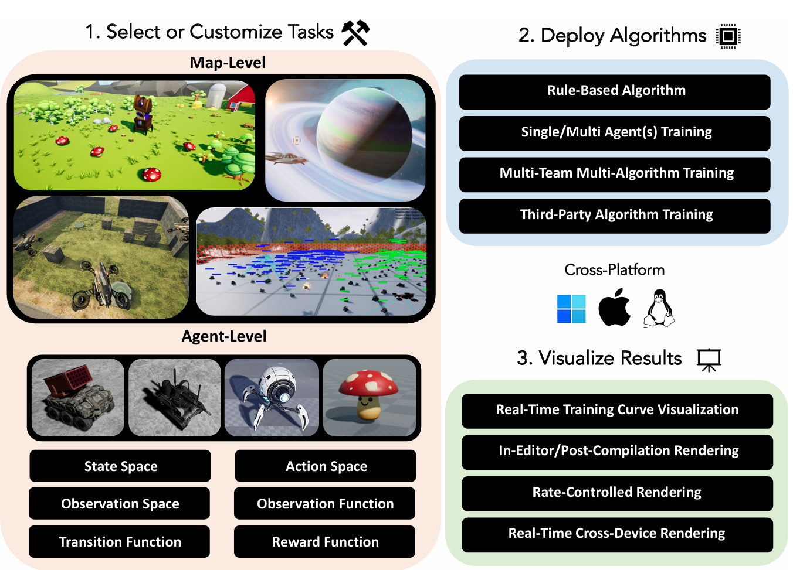
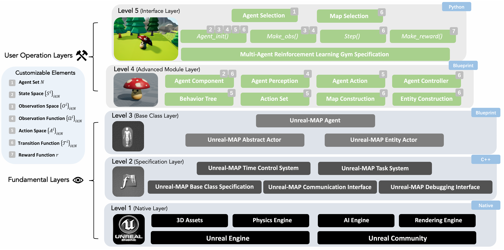

# Unreal-MAP 

[English](README.md) | [中文](README_CN.md)

[](https://github.com/binary-husky/unreal-map)
[](LICENSE)
[](https://www.python.org/)
[](https://www.unrealengine.com/)
[](https://github.com/binary-husky/unreal-map)
[](README_CN.md)


这是**虚幻多智能体游乐场**（Unreal-MAP），一个基于[虚幻引擎](https://www.unrealengine.com/)的多智能体通用平台。
在这里，您可以使用虚幻引擎的所有功能（蓝图、行为树、物理引擎、AI导航、3D模型/动画和插件资源等）来构建优雅（但也计算高效）和宏伟（但也实验可重现）的多智能体环境。

Unreal-MAP不仅可以用于开发常规的多智能体仿真环境，还针对多智能体强化学习（MARL）仿真进行了特殊优化。您可以使用它来开发各种真实和复杂的MARL场景。您还可以将Unreal-MAP与我们开发的[HMAP](https://github.com/binary-husky/hmp2g)（一个强大的MARL专用实验框架）一起使用，轻松开发MARL场景并快速部署前沿算法。


> 本研究旨在寻找潜在的合作伙伴。如果对这个研究项目感兴趣，请随时联系我们中科院自动化研究所的办公室：tenghai.qiu@ia.ac.cn, hutianyi2021@ia.ac.cn。
> 


**请为Github项目点亮```star```。作为研究人员，您的鼓励对我们来说极其重要：```https://github.com/binary-husky/unreal-hmp```** ！


<div align="center">
 
</div>

# 简介
基于虚幻引擎的多智能体游乐场（Unreal-MAP）是一个基于虚幻引擎的新一代多智能体通用平台。
该平台支持群体与算法之间的对抗训练，是第一个（也是目前唯一一个）支持多团队训练的基于虚幻引擎的可扩展RL/MARL环境。

<div align="center">
 
</div>

Unreal-MAP采用分层五层架构，每一层都建立在前一层之上。从底层到顶层，这五层分别是：*原生层*、*规范层*、*基类层*、***高级模块层***和***接口层***。
**您只需要关注*高级模块层*（蓝图）和*接口层*（Python）**。
从创建标准MARL环境的角度来看，使用这两层就足以修改任务中的所有元素（例如POMDP），如状态、动作、观察、转换等。

Unreal-MAP可用于开发各种多智能体仿真场景。我们的案例研究已经包括了具有大规模、异构和多团队特征的场景。
**与其他RL通用平台**相比，如[Unity ML-Agents](https://unity-technologies.github.io/ml-agents/)，Unreal-MAP在科研和实验方面具有以下优势：

**(1) 完全开源且易于修改**：Unreal-MAP采用分层设计，从底层引擎到顶层接口的所有组件都是开源的。

**(2) 专门针对MARL优化**：Unreal-MAP的底层引擎已经过优化，以提高大规模智能体仿真和数据传输的效率。

**(3) 并行多进程执行和可控的单进程时间流**：Unreal-MAP支持多个仿真进程的并行执行以及单个进程中仿真时间流速度的调整。您可以加速仿真以加快训练速度，或减速仿真以进行详细的慢动作分析。


**与目前所有的MARL仿真环境相比**，Unreal-MAP在科研和实验方面具有优势：

- 使用[虚幻引擎市场](https://www.fab.com/)中的海量资源**自由构建真实任务**。
- 同时支持**大规模、异构、多团队**仿真。
- **高效训练**，TPS（每秒时间步数）高达10k+，FPS（每秒帧数）高达10M+。
- **可控的仿真时间**：您可以加速仿真以加快训练速度（直到CPU完全利用，加速不会消耗额外的内存或显存），或减速以进行慢动作分析。
- **强大的可重现性**：消除了虚幻引擎中可能导致实验不可重现的各种蝴蝶效应因素。
- **多平台支持**：在Windows、Linux和MacOS上编译无头模式和渲染模式客户端。
- **丰富的渲染机制**：支持a）在UE编辑器中渲染，b）在编译的纯渲染客户端上渲染，c）跨平台实时渲染。

<div align="center">
  
</div>

<div align="center">
  
</div>
<div align="center">
  
</div>


# 如何安装 

## 完整版本

- 步骤1，您必须从源代码安装虚幻引擎。详情请参见虚幻引擎官方文档：```https://docs.unrealengine.com/4.27/zh-CN/ProductionPipelines/DevelopmentSetup/BuildingUnrealEngine/```
- 步骤2：克隆git仓库 ```git clone https://github.com/binary-husky/unreal-hmp.git```
- 步骤3：下载github无法管理的大文件。运行 ```python Please_ Run_ This_ First_ To_ Fetch_ Big_ Files.py```
- 步骤4：右键点击步骤3中下载的```UHMP.upproject```，选择```切换虚幻引擎版本```，然后选择```source build at xxxxx```确认。然后打开生成的```UHMP.sln```并编译
- 最后，双击```UHMP.upproject```进入虚幻引擎编辑器。

注意，步骤1和4比较困难。建议参考以下视频（视频中0:00->1:46是步骤1，1:46->结束是步骤4）：```https://ageasga-my.sharepoint.com/:v:/g/personal/fuqingxu_yiteam_tech/EawfqsV2jF5Nsv3KF7X1-woBH-VTvELL6FSRX4cIgUboLg?e=Vmp67E```


## 仅编译二进制版本 

```https://github.com/binary-husky/hmp2g/blob/master/ZDOCS/use_unreal_hmap.md```

# 教程 
文档正在完善中。关于简单演示的视频教程，请参见```EnvDesignTutorial.pptx```（您需要完成安装步骤3才能下载此pptx文件）

目录：
- 第一章 虚幻引擎
- - 构建地图（Level）```https://www.bilibili.com/video/BV1U24y1D7i4/?spm_id_from=333.999.0.0&vd_source=e3bc3eddd1d2414cb64ae72b6a64df55```
- - 建立智能体Actor
- - 设计智能体蓝图程序逻辑
- - Episode关键事件通知机制
- - 定义自定义动作（虚幻引擎端）
- - Python端控制智能体的自定义参数
- 第二章 Python接口
- - 创建任务文件（SubTask）
- - 修改智能体初始化代码
- - 修改智能体奖励代码
- - 选择每个团队的控制算法
- - 完整闭环调试方法
- 第三章 附录
- - 无头加速和交叉编译Linux包
- - 定义自定义动作（需要先熟悉完整闭环调试方法）
- - - 起草动作列表
- - - Python端动作生成
- - - UE端动作解析和执行
- - - 动作离散化
- - 交叉编译工具链安装指南


# 如何构建二进制客户端
运行以下脚本。
```
python BuildlinuxRender.py
python BuildLinuxServer.py
python BuildWinRender.py
python BuildWinServer.py
```
- 其中，```Render/Server```代表```包含图形渲染/仅计算```，后者通常用于RL训练。
- 其中，```Windows/linux```代表目标操作系统。注意，您需要安装```虚幻引擎交叉编译工具```才能在Windows上编译Linux程序。


# 常见问题
- 在```Content/Assets/DefAction/ParseAction.uasset```中添加新的ActionSets后，打包时可能遇到```Ensure condition failed: !FindPin(FFunctionEntryHelper::GetWorldContextPinName())```错误。如果出现这种情况，请在```ParseAction.uasset```中找到并删除您不小心创建的名为```__WorldContext```的额外蓝图函数参数。更多详情：```https://forums.unrealengine.com/t/ensure-condition-failed-on-project-start/469587```

- 如果在项目迁移后遇到BuildCMakeLib.Automation.cs(45,54): error CS1002，请在Visual Studio中**重新构建**（不是构建！）AutomationTool。更多详情：```https://forums.unrealengine.com/t/unreal-engine-version-4-27-2-i-get-an-error-when-trying-to-package-any-project/270627```

# 引用
```
@article{unrealmap,
  title={Unreal-MAP: Unreal-Engine-Based General Platform for Multi-Agent Reinforcement Learning},
  author={Hu, Tianyi and Fu, Qingxu and Pu, Zhiqiang and Wang, Yuan and Qiu, Tenghai},
  journal={arXiv preprint arXiv:2503.15947},
  year={2025}
}
```

# Dev log 项目开发日志
- 2023-10-18 版本3.14
- 2023-4-30 版本3.8，引入标准化的高效感知模块
- 2023-3-9 正在尝试用共享内存通讯替换tcp通讯，以提高IO效率，待上传到4.0版本
- 2023-3-1 实现高效感知模块，待上传到4.0版本
- 2023-2-15 版本3.7融入master分支
- 2023-2-14 3.7上传中
- 2023-2-14 ```EnvDesignTutorial.pptx```中更新了自定义动作的文档
- 2023-2-14 上传了一个微缩版的hmp代码，作为入门用的U-MAP驱动，文档待写
- 2023-2-1 将读起来蹩脚的UHMAP缩写名称改为U-Map
- 2023-1-8 update readme
- 2023-12-25 covid is not a flu /(ㄒoㄒ)/
- 2022-12-22 版本3.6融入master分支
- 2022-12-21 解决智能体scale!=1的情况下，飞行智能体高度越来越低的问题
- 2022-12-21 修复超大规模智能体数量情况下缓存区溢出的问题
- 2022-12-18 优化大文件下载脚本
- 2022-12-17 版本3.5融入master分支

