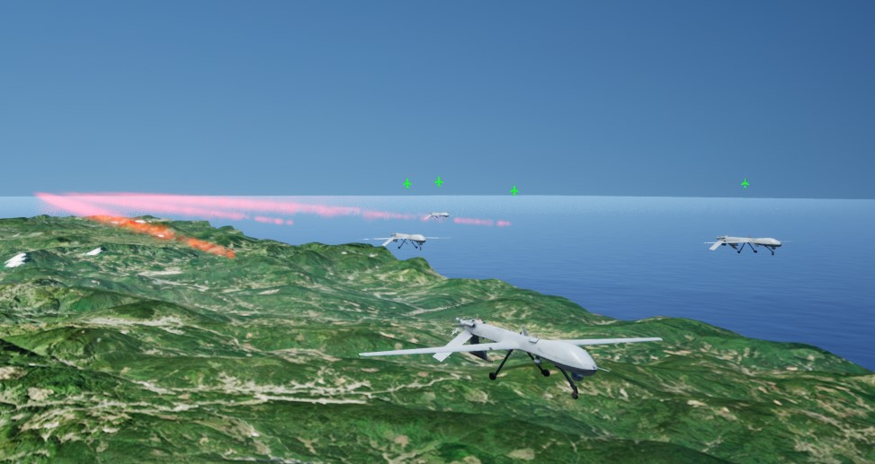
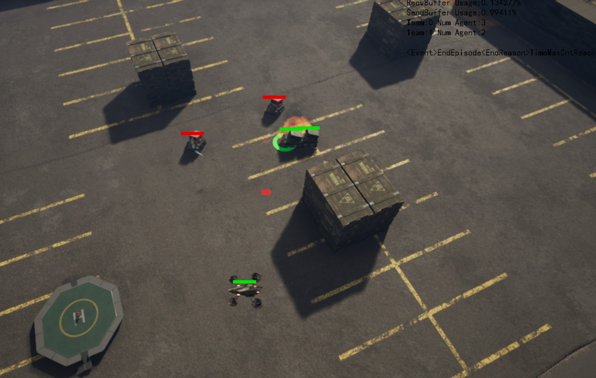
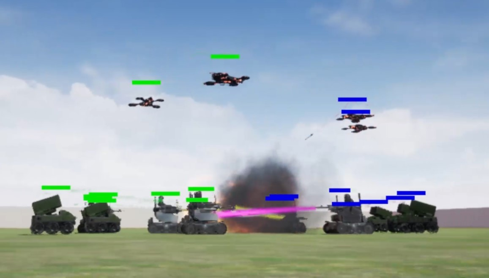

> The present study aims to identify potential collaboration partners. If interested in this research project, please feel free to contact our office at CASIA: tenghai.qiu@ia.ac.cn.
> 
> 我们（中科院自动化研究所，群体智能团队）欢迎来自各院所的合作伙伴，可分享拓展资源（地图，智能体建模等），请通过以下邮箱联系我们：`tenghai.qiu@ia.ac.cn`，`hutianyi2021@ia.ac.cn`


# Unreal-MAP (原名: UHMP)

[English](README.md) | [中文](README_CN.md)

[](https://github.com/binary-husky/unreal-map)
[](LICENSE)
[](https://www.python.org/)
[](https://www.unrealengine.com/)
[](https://github.com/binary-husky/unreal-map)
[](README_CN.md)


This is Unreal-based Multi-Agent Playground (U-Map, previous project name is UHMP for ~~Hybrid Unreal-based Multi-agent Playground~~)

Here you can use all the capabilities of Unreal Engine (Blueprints, Behavior tree, Physics engine, AI navigation, 3D models/animations and Plugin resources, etc) to build elegant (but also computational efficient) and magnificent (but also experimentally reproducible) multi-agent environments.

Developed with Unreal Engine, documenting is in process. 基于UnrealEngine开发，文档正在完善中。


**Please ```star``` the Github project. Your encouragement is extremely important to us as researchers: ```https://github.com/binary-husky/unreal-hmp```** 此项目处于活跃开发阶段，请打星关注哦。 

<div align="center">
  
</div>


# Intro 简介
Unreal-based Multi-Agent Playground (U-Map, previously called UHMP) is a new generation of multi-agent environment simulation environment based on the Unreal Engine.
This platform supports adversial training between swarms & algorithms, and it is the first (and currently the only) Extensible RL environment based on the Unreal Engine to support multi-team training.
U-Map is oriented to adversarial heterogeneous multi-agent reinforcement learning scenarios.
The interface is written in Python,
The Unreal Engine part uses C++ to handle the communication interface with Python, and other parts use blueprints.
The project introduces libs such as xtensor to accelerate the mathematical operations of C++.
In terms of scientific research and experiment:
- Pure computing mode that can be compiled into Headless (i.e. dedicated server for training)
- Simulation acceleration at any rate can be achieved until the CPU burns
- Strong repeatability. We have already solved various butterfly effect factors in Unreal Engine that would cause unrepeatable experiments when repeating random seed.
- Support large-scale Swarm. The communication protocol with Python is highly optimized to avoid IO jam caused by the increase of the number of agents
- Very efficient, extremely CPU efficient. The Unreal Engine itself is far more efficient than expected.
- Cross platform. Whether Windows, Linux, or MacOs can compile Headless mode and rendering mode clients
- You can connect the headless process in training across OS, and even watch the environment in training

Unreal-based Multi-Agent Playground (U-Map, 之前的名称是UHMP) 是基于虚幻引擎的新一代多智能体环境仿真环境。
该平台支持多队伍对抗，为第一个（也是目前为止唯一一个）基于虚幻引擎的多智能体+多队伍强化学习环境。
U-Map面向对抗性异构多智能体强化学习场景。
接口部分采用Python编写，
虚幻引擎部分采用C++处理与Python的通讯接口，其他部分采用蓝图。
项目引入xtensor用于加速C++部分的数学运算。
在科研实验方面：
- 可编译为Headless的纯计算模式（即dedicated server，用于训练）
- 可实现任意倍率的仿真加速，直到跑满CPU
- 可重复性强。排除了UnrealEngine中各种会造成实验不可重复的蝴蝶效应因素
- 支持大规模。与Python端的通讯协议高度优化，避免了随智能体数量增多导致的IO卡顿
- 非常高效，极其节省CPU。Unreal引擎本身的效率远超预想。
- 跨平台。不管是Windows、Linux还是MacOs都能编译Headless模式和渲染模式的客户端
- 可跨OS连接训练中的Headless进程，甚至可以观看训练中的环境.

<div align="center">
  
</div>
<div align="center">
  
</div>


- 可以利用虚幻引擎商城中的巨量资源自由构建真实的任务
- 同时支持大规模、异构、多队伍仿真
- 训练高效，（Timestep per second）TPS可达10k+, (Frame per second) FPS可达10M+
- 可控仿真时间，可以加速仿真以加快训练（直到跑满CPU，加速并不占用更多内存和显存），也可以减速仿真以进行慢动作分析。
- 可重复性强。排除了UnrealEngine中各种会造成实验不可重复的蝴蝶效应因素
- 多平台支持。可以在Windows、Linux、MacOs上编译Headless模式和渲染模式的客户端。
- 丰富的渲染机制。支持 a) rendering in the UE editor, b) on a compiled pure rendering client, c) cross-platform real-time rendering.

# Install 安装方法

- Step 1, you must install the Unreal Engine from the source code. For details, see the official document of the Unreal Engine: ```https://docs.unrealengine.com/4.27/zh-CN/ProductionPipelines/DevelopmentSetup/BuildingUnrealEngine/```
- Step 2: Clone the git resp ```git clone https://github.com/binary-husky/unreal-hmp.git```
- Step 3: Download large files that github cannot manage. Run ```python Please_ Run_ This_ First_ To_ Fetch_ Big_ Files.py```
- Step 4: Right click the ```UHMP.upproject``` downloaded in step 3, select ```switch unreal engine version```, and then select ```source build at xxxxx``` to confirm. Then open the generated ```UHMP. sln``` and compile it
- Finally, double-click ```UHMP. upproject``` to enter the Unreal Engine Editor.

Note that steps 1 and 4 are difficult. It is recommended to refer to the following video (the 0:00->1:46 in the video is the steps 1, and 1:46->end is steps 4): ```https://ageasga-my.sharepoint.com/:v:/g/personal/fuqingxu_yiteam_tech/EawfqsV2jF5Nsv3KF7X1-woBH-VTvELL6FSRX4cIgUboLg?e=Vmp67E```


- 第1步，必须从```源代码```安装虚幻引擎，具体方法见虚幻引擎的官方文档：https://docs.unrealengine.com/4.27/zh-CN/ProductionPipelines/DevelopmentSetup/BuildingUnrealEngine/
- 第2步，克隆本仓库。```git clone https://github.com/binary-husky/unreal-hmp.git```
- 第3步，下载github不能管理的大文件。运行```python Please_Run_This_First_To_Fetch_Big_Files.py```。
- 第4步，```右```击第3步下载得到的```UHMP.uproject```，选择```switch unreal engine version```，再选择```source build at xxxxx```确认。然后打开生成的```UHMP.sln```，编译即可。
- 最后，双击```UHMP.uproject```进入虚幻引擎编辑器。

注意，第1步和第4步较难，建议参考以下视频（视频中前1分46秒为第1步流程，后面为第4步流程）： ```https://ageasga-my.sharepoint.com/:v:/g/personal/fuqingxu_yiteam_tech/EawfqsV2jF5Nsv3KF7X1-woBH-VTvELL6FSRX4cIgUboLg?e=Vmp67E```

# Only install compiled binary 直接安装编译后的二进制客户端

```https://github.com/binary-husky/hmp2g/blob/master/ZDOCS/use_unreal_hmap.md```

# Tutorial 环境设计方法
The document is being improved. For the video tutorial of simple demo, see ```EnvDesignTutorial.pptx``` (you need to complete step 3 of installation to download this pptx file)

Directory:
- Chapter I. Unreal Engine
- - Build a map (Level) ```https://www.bilibili.com/video/BV1U24y1D7i4/?spm_id_from=333.999.0.0&vd_source=e3bc3eddd1d2414cb64ae72b6a64df55```
- - Establish Agent Actor
- - Design agent blueprint program logic
- - Episode key event notification mechanism
- - Define Custom actions (Unreal Engine side)
- - The Python side controls the custom parameters of the agent
- Chapter II. Python Interface
- - Create a task file (SubTask)
- - Modify agent initialization code
- - Modify the agent reward code
- - Select the control algorithm of each team
- - Full closed loop debugging method
- Chapter III. Appendix
- - Headless acceleration and cross-compiling Linux package
- - Define Custom actions (Need to be familiar with the full closed-loop debugging method first)
- - - Draft a list of actions
- - - Python side action generation
- - - UE-side action parse and execution
- - - Action discretization
- - Installation guide for cross compilation tool chain

文档正在完善，简单demo的视频教程见```EnvDesignTutorial.pptx```（需要完成安装步骤3以下载此pptx文件） 

设计方法目录：
- 第一章 虚幻引擎部分
- -  1.1 建立地图（Level）:  ```https://www.bilibili.com/video/BV1U24y1D7i4/?spm_id_from=333.999.0.0&vd_source=e3bc3eddd1d2414cb64ae72b6a64df55```
- -  1.2 建立智能体蓝图（Agent Actor）
- -  1.3 设计智能体蓝图程序逻辑
- -  1.4 Episode关键事件通知机制
- -  1.5 自定义动作（虚幻引擎侧）（见第三章）
- -  1.6 由Python端控制Agent的自定义参数
- 第二章 Python接口部分
- -  2.1 建立任务文件（SubTask）
- -  2.2 修改智能体初始化代码
- -  2.3 修改智能体奖励代码
- -  2.4 选择各队伍的控制算法
- -  2.5 全闭环调试方法（Python-UMAP回环）
- 第三章 附录
- -  3.1 无渲染加速与交叉编译Linux二进制包
- -  3.2 自定义动作 （需要首先熟悉2.5全闭环调试方法）
- - - 3.2.1 起草动作清单
- - - 3.2.2 Python侧动作生成
- - - 3.2.3 UE侧动作解析与执行
- - - 3.2.4 强化学习动作离散化

- -  3.3 交叉编译工具链的安装指南

# Build binary 编译二进制客户端的方法
Run following scripts.
- Among them, ```Render/Server``` represents ```including graphic rendering / only computing```, the later is generally used for RL training.
- Among them, ```Windows/linux``` represents the target operating system. Note that you need to install ```Unreal Engine Cross Compilation Tool``` to compile Linux programs on Windows.

运行一下脚本即可。
- 其中```Render/Server```代表```包含图形渲染/无界面仅计算```，后者一般用于RL训练。
- 其中```Win/linux```代表目标操作系统，注意在windows上编译linux程序需要安装```虚幻引擎交叉编译工具```。
```
python BuildlinuxRender.py
python BuildLinuxServer.py
python BuildWinRender.py
python BuildWinServer.py
```

- After adding new ActionSets in ```Content/Assets/DefAction/ParseAction.uasset```. You may encounter ```Ensure condition failed: !FindPin(FFunctionEntryHelper::GetWorldContextPinName())``` error during packaging, if so, find and remove an extra blueprint function parameter named ```__WorldContext``` that you created by accident in ```ParseAction.uasset```.  如果在添加新的自定义动作之后遇到上述错误，说明你无意间添加了一个叫```__WorldContext```的蓝图函数参数，找到并删除它即可。 ```https://forums.unrealengine.com/t/ensure-condition-failed-on-project-start/469587```.

- 如果在迁移项目后发生BuildCMakeLib.Automation.cs(45,54): error CS1002，请在VS中重新生成 (**Rebuild**, not Build!) AutomationTool即可。```https://forums.unrealengine.com/t/unreal-engine-version-4-27-2-i-get-an-error-when-trying-to-package-any-project/270627```

# cite this project
```
@misc{fu2023unrealmap,
  author = {Qingxu Fu and Tianyi Hu},
  title = {U-Map: Developing Complex Multi-Agent Reinforcement Learning Benchmarks with Unreal Engine.},
  howpublished = {\url{https://github.com/binary-husky/unreal-map/}},
  year = {2023}
}
```

# Dev log 项目开发日志
- 2023-10-18 版本3.14
- 2023-4-30 版本3.8，引入标准化的高效感知模块
- 2023-3-9 正在尝试用共享内存通讯替换tcp通讯，以提高IO效率，待上传到4.0版本
- 2023-3-1 实现高效感知模块，待上传到4.0版本
- 2023-2-15 版本3.7融入master分支
- 2023-2-14 3.7上传中
- 2023-2-14 ```EnvDesignTutorial.pptx```中更新了自定义动作的文档
- 2023-2-14 上传了一个微缩版的hmp代码，作为入门用的U-MAP驱动，文档待写
- 2023-2-1 将读起来蹩脚的UHMAP缩写名称改为U-Map
- 2023-1-8 update readme
- 2023-12-25 covid is not a flu /(ㄒoㄒ)/
- 2022-12-22 版本3.6融入master分支
- 2022-12-21 解决智能体scale!=1的情况下，飞行智能体高度越来越低的问题
- 2022-12-21 修复超大规模智能体数量情况下缓存区溢出的问题
- 2022-12-18 优化大文件下载脚本
- 2022-12-17 版本3.5融入master分支
