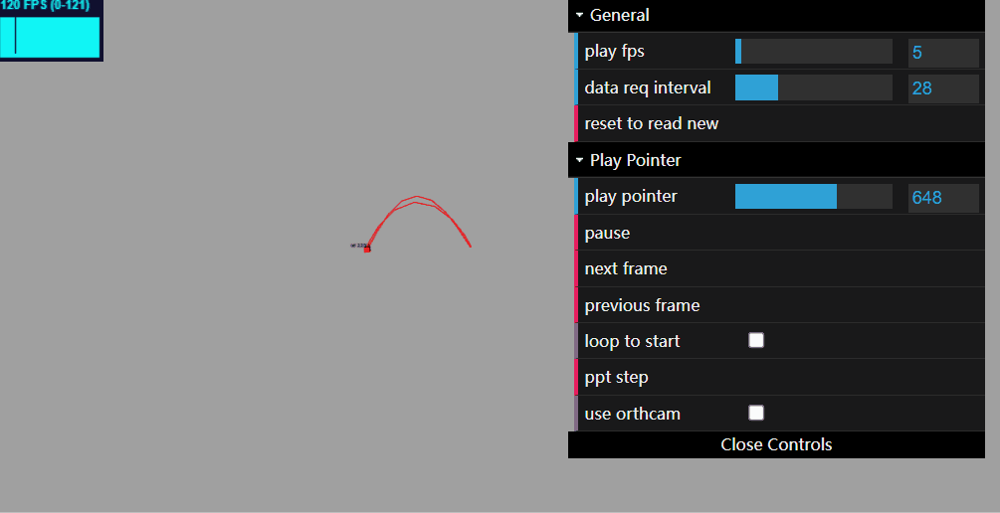
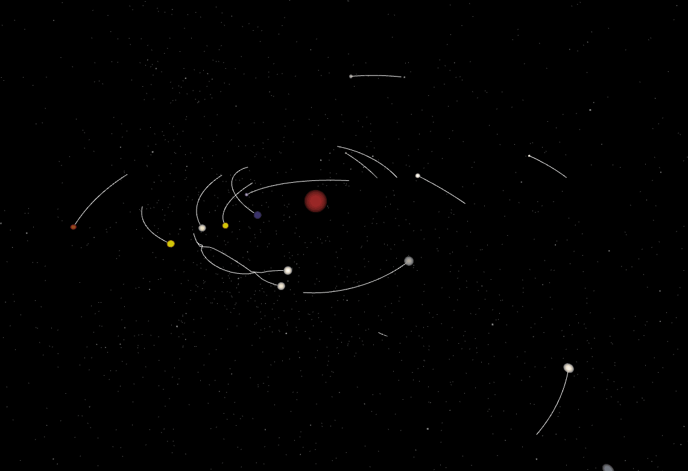
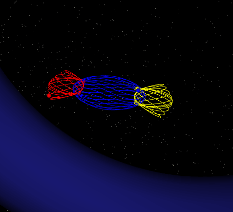
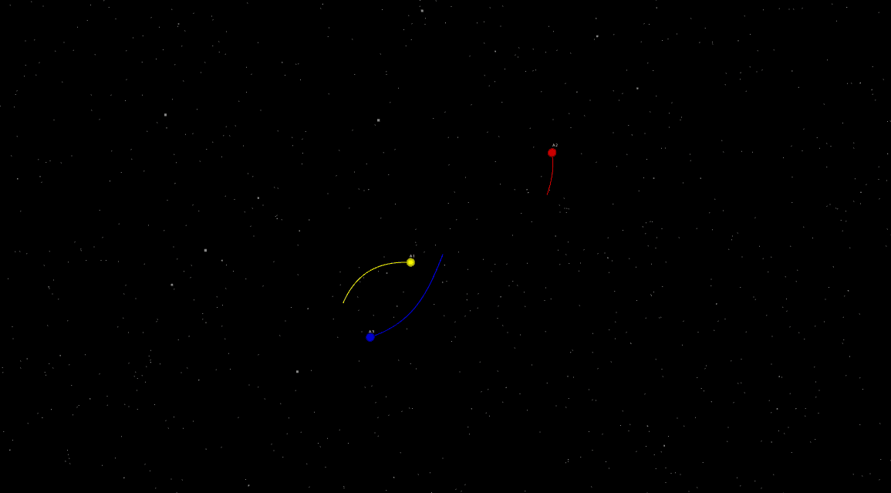

# Visual Hybrid Multi-Agent Playground (VHMAP 使用说明书)
## 面向场景和特点
面向场景：
- 科研，尤其是多智能体强化学习领域
- 3D演示
- 娱乐

应用特点：
- Python接口简化到极致
- 渲染在客户端，自动插帧，纵享丝滑帧率
- 服务端依赖少
- 占用服务端资源极少
- 基于ThreeJs，支持拖动，支持手机触屏
- 支持透视和投影两种视图的切换
- 支持回放
- 使用zlib压缩数据流，网络带宽需求小

## 安装 
```shell
pip install vhmap
```

## 20行代码-展示VHMAP的简单、丝滑
实现下图，仅需要20行python代码(含初始化)
<div align="center">

</div>

界面功能、操作介绍：
- 鼠标右键平移，左键旋转，滚轮缩放
- 支持触屏，如果你笔记本或手机有触控屏幕
- 左上角显示渲染刷新率
- play fps：每秒播放多少关键帧(小于渲染刷新率，则插帧；大于渲染刷新率，则超出部分无效)
- pause：暂停
- next frame：暂停并切换下一帧
- previous frame：暂停并切换上一帧
- loop to start：播放完所有数据，回到第一帧
- ppt step：以极慢极慢的速度播放一帧，方便录屏，按下后会卡顿几秒
- use orthcam：切换透视视图（物体近大远小）/投影视图（工程制图学过没），
- P.S. 第一次切换到投影视图时，需要用鼠标滚轮放大画面

```python
from VISUALIZE.mcom import mcom
import numpy as np
class TestVhmap():
    def render(self, t):
        if not hasattr(self, '可视化桥'):
            self.可视化桥 = mcom(path='TEMP/v2d_logger/', draw_mode='Threejs')
            self.可视化桥.初始化3D()
            self.可视化桥.设置样式('gray')
            self.可视化桥.其他几何体之旋转缩放和平移('box', 'BoxGeometry(1,1,1)',   0,0,0,  1,1,1, 0,0,0) 

        x = np.cos(t); y=np.sin(t); z= np.cos(t)*np.sin(t)  # 此帧的x,y,z坐标
        self.可视化桥.发送几何体(
            'box|2233|Red|0.1',     # 填入 ‘形状|几何体之ID标识|颜色|大小’即可
            x, y, z, ro_x=0, ro_y=0, ro_z=np.sin(t),    # 三维位置+欧拉旋转变换，六自由度
            track_n_frame=20)                           # 显示历史20帧留下的轨迹
        self.可视化桥.结束关键帧()

if __name__ == '__main__':
    x = TestVhmap()
    for step in range(1000): x.render(t=step/np.pi)
    import time; time.sleep(1000)   # 启动后打开输出的url地址即可
# 这是第21行，已经写完了 :joy: 
```

## 50行代码-演示3维N体运动(低精度定步长)
- 代码1详情请见：VISUALIZE/examples/nb.py
运行方法：
```
pip install vhmap

python -m VISUALIZE.examples.nb
```
<div align="center">

</div>

## 90行代码-使用dop853求解常微分方程演示三体、N体运动
- 代码2详情请见：VISUALIZE/examples/nb_3body_specials.py
- 代码3详情请见：VISUALIZE/examples/nb_nbody_specials.py
```
pip install vhmap

python -m VISUALIZE.examples.nb_3body_specials
```
<div align="center">



</div>
感谢 Xiaoming LI and Shijun LIAO, Shanghai Jiaotong University, China 的三体初始值：
https://numericaltank.sjtu.edu.cn/three-body/three-body-movies.htm

## 如何回放
VHMAP在接收到数据后，会自动地在 TEMP/v2d_logger/ 路径下生成backup.dp数据文件，该文件可以用于回放。

警告：数据文件会在下一次运行时被新的日志文件覆盖，必要时请手动备份！
```
python -m VISUALIZE.threejs_replay -f TEMP/v2d_logger/backup.dp.gz -p 8085
```
其中-f后面的是回放文件的路径，-p接端口号例如8085，之后打开 http://localhost:8085 即可。


## API-中文

引入
```python
from VISUALIZE.mcom import mcom
```

### 初始化
```python
可视化桥 = mcom(path='TEMP/v2d_logger/', draw_mode='Threejs')
可视化桥.初始化3D()
```

### 设置样式
```python
可视化桥.设置样式('star')       # 布置星空
可视化桥.设置样式('grid')       # 布置2维网格
可视化桥.设置样式('grid3d')     # 布置3维网格
可视化桥.设置样式('earth')      # 在场景中放一个地球
可视化桥.设置样式('background', color='White') # 注意不可以省略参数键值'color=' ！

# 如果label要使用中文字符，需要设置字体，否则字符会变成问号'?'
可视化桥.设置样式('font', font_path='/examples/fonts/ttf/HGXH_CNKI.TTF') # 注意不可以省略参数键值'font_path=' ！
# 如果label要使用中文字符，而且需要换行，则还需要额外设置行距 fontLineHeight
可视化桥.设置样式('font', fontPath='/examples/fonts/ttf/simhei.ttf', fontLineHeight=1500)   


可视化桥.设置样式('skybox', path='/wget/shabby.jpg')    # 设置天空盒子，注意不可以省略参数键值'path='
可视化桥.设置样式('skybox6side',    # 设置天空盒子，注意不可以省略参数键值 !!
    posx='/wget/mars_textures/mars_posx.jpg',   
    negx='/wget/mars_textures/mars_negx.jpg',   
    posy='/wget/mars_textures/mars_posy.jpg',
    negy='/wget/mars_textures/mars_negy.jpg',
    posz='/wget/mars_textures/mars_posz.jpg',
    negz='/wget/mars_textures/mars_negz.jpg',
)


```

### 声明几何体
```python
# declare geo 'oct1', init with OctahedronGeometry, then (1)rotate & (2)scale & (3)translate
可视化桥.其他几何体之旋转缩放和平移('oct1', 'OctahedronGeometry(1,0)', 0,0,0,  1,1,1, 0,0,0)   # 八面体
# 需要换成其他几何体，请把'OctahedronGeometry(1,0)'替换，参考网址 https://threejs.org/docs/index.html?q=Geometry
可视化桥.其他几何体之旋转缩放和平移('any_name_you_want', 'TorusGeometry(10,3,16,100)',   0,0,0,  1,1,1, 0,0,0) # 甜甜圈
# declare geo 'ball'
可视化桥.其他几何体之旋转缩放和平移('ball', 'SphereGeometry(1)',   0,0,0,  1,1,1, 0,0,0) # 球体
# declare geo 'box'
可视化桥.其他几何体之旋转缩放和平移('box', 'BoxGeometry(1,1,1)',   0,0,0,  1,1,1, 0,0,0) # 长方体
# declare geo 'Plane', 使用fbx模型，路径为/VISUALIZE/threejsmod/examples/files/plane.fbx
可视化桥.其他几何体之旋转缩放和平移('Plane', 'fbx=/examples/files/plane.fbx', -np.pi/2, 0, np.pi/2,  1,1,1, 0,0,0)   # 八面体

```

### 发送几何体，可用颜色（JS颜色，支持Hex颜色）参考 https://www.w3schools.com/colors/colors_names.asp
```python
# 注意不可以省略参数键值
x=1; y=2; z=3
可视化桥.发送几何体(
    'ball|8848|MidnightBlue|0.5',  # 填入核心参量： “已声明的形状|几何体的唯一ID标识|颜色|整体大小”
    x, y, z,                # 三维位置，3/6dof
    ro_x=0, ro_y=0, ro_z=0, # 欧拉旋转变换，3/6dof
    # ro_order='XYZ',       # （测试中，勿使用）欧拉旋转顺序，详情见 https://threejs.org/docs/index.html?q=object#api/en/math/Euler
    opacity=1,              # 透明度，1为不透明
    renderOrder=0,          # 渲染顺序。合理使用，能解决透明物体异常遮蔽的情况
    label='',               # 显示标签，空白不显示，用'\n'换行
    label_color='White',    # 标签颜色
    # label_offset=np.array([0,2,2]), # 标签与物体之间的相对位置，实验选项，测试中，勿使用
    # label_size=0.5, # 测试中，勿使用
    track_n_frame=3,        # 是否显示轨迹（0代表否），轨迹由最新的track_n_frame次位置连接而成
    track_tension=0.1,      # 轨迹曲线的平滑度，0为不平滑，推荐设置0不平滑
    track_color='Green',    # 轨迹的颜色显示，输入js颜色名或者hex值均可
    )
```
其中的“renderOrder”选项比较难以理解，如果没有显示异常，则设置为0，或者干脆删除该键值（默认0）。

用它解决的问题是简单的：
```
If: 一个（透明）物体A 被 一个透明物体B遮挡，但A部分或全部不可见
Then: 增加B的renderOrder，或者减小A的renderOrder（取值范围0~127）

此外，label标签的渲染顺序renderOrder是128，任意全透明物体的渲染顺序renderOrder是256
```
### 发送曲线
```python
# 画一条(0,0,0) -> (1,1,0) -> (2,2,0) -> (3,3,0) 的线
# 注意不可以省略参数键值!!
可视化桥.发送线条(
    'simple|3999|MidnightBlue|0.004', # 填入核心参量： “simple|线条的唯一ID标识|颜色|整体大小”
    x_arr=np.array([0, 1, 2, 3]),   # 曲线的x坐标列表
    y_arr=np.array([0, 1, 2, 3]),   # 曲线的y坐标列表
    z_arr=np.array([0, 0, 0, 0]),   # 曲线的z坐标列表
    tension=0,  # 曲线的平滑度，0为不平滑，推荐不平滑
    opacity=1,  # 透明度，1为不透明，不稳定仍然在测试中
)

# fat 型线条，支持调节宽度、虚线、透明度等，但是不稳定仍然在测试中
# 注意不可以省略参数键值!!
可视化桥.发送线条(
    'fat|3999|MidnightBlue|0.004', # 填入核心参量： “fat|线条的唯一ID标识|颜色|整体大小”
    x_arr=np.array([0, 1, 2, 3]),   # 曲线的x坐标列表
    y_arr=np.array([0, 1, 2, 3]),   # 曲线的y坐标列表
    z_arr=np.array([0, 0, 0, 0]),   # 曲线的z坐标列表
    dashScale=20,   # 此数越大，单位长度上的虚线切割越多
    dashSize=1,     # 虚线切割之实线
    gapSize=1,      # 虚线切割之实线间隔
    tension=0,      # 曲线的平滑度，0为不平滑，推荐不平滑
    opacity=1,      # 透明度，1为不透明
)
```

### 发射光束（从几何体src到几何体dst）
```python
# 注意不可以省略参数键值!!
可视化桥.发射光束(
    'beam',         # 有 beam 和 lightning 两种选择
    src=index_ID,   # 发射者的几何体的唯一ID标识
    dst=index_ID2,  # 接收者的几何体的唯一ID标识
    dur=0.5,        # 光束持续时间，单位秒，绝对时间，不受播放fps的影响
    size=0.03,      # 光束粗细
    color='DeepSkyBlue' # 光束颜色
)

```


终结这一帧（并开始下一帧）
```python
self.可视化桥.结束关键帧()
```


### 测试中-添加贴图
```python
可视化桥.advanced_geometry_material('ball', 
    map='/examples/planets/images/earthmap1k.jpg',
    bumpMap='/examples/planets/images/earthmap1k.jpg',
    bumpScale = 0.05,
    specularMap='/examples/images/earthmap1k.jpg',
    specular='Gray'
)  
```


## API-Eng

In fact, this project is developed in Eng API,
but I do not have time to write document.
The api alignment can be found in mcom.py:
```
别名对齐 = [
    ('初始化3D', 'v2d_init'),
    ('设置样式', 'set_style'),
    ('形状之旋转缩放和平移','geometry_rotate_scale_translate'),
    ('其他几何体之旋转缩放和平移','advanced_geometry_rotate_scale_translate'),
    ('发送几何体','v2dx'),
    ('结束关键帧','v2d_show'),
    ('发送线条','line3d'),
    ('发射光束','flash'),
]
```